## 👋 Byte Me, Google | GDG Solutions Challenge 2025

We're an undergrad team building **EduLingo** - an AI-powered multilingual educational platform that transforms passive learning into interactive experiences. Currently caffeinating our way through the Google Hackathon with a tech stack that combines modern frameworks, cloud solutions, and AI to break language barriers in education.

#### Here's a small overview:

```mermaid
flowchart TB
    %% Entry Points with Custom Shapes
    User(["👤 Users"])
    MobileApp[["📱 Mobile App"]]
    WebApp[["💻 Web Portal"]]
    
    %% Frontend Layers with Technical Details
    subgraph Frontend["Frontend Layer"]
        direction TB
        subgraph UIFramework["UI & Rendering"]
            next["▶️ Next.js v14"]
            ts["📝 TypeScript 5.3"]
            tw["🎨 TailwindCSS 3.4"]
            shadcn["🧩 shadcn/ui Components"]
            hero["🦸 Hero UI Library"]
        end
        
        subgraph ClientApps["Client Applications"]
            electron["⚛️ Electron v28 (Desktop)"]
            pwa["📲 PWA/Service Workers"]
            reactNative["📱 React Native v0.73"]
        end
        
        subgraph StateManagement["State Management"]
            tanstack["🔄 TanStack Query v5"]
            zustand["🐻 Zustand State"]
            redux["🔄 Redux Toolkit + RTK Query"]
            jotai["⚛️ Jotai Atoms"]
        end
        
        subgraph UIUtilities["UI Utilities"]
            i18n["🌐 i18n/react-intl"]
            a11y["♿ Accessibility (ARIA)"]
            darkmode["🌓 Theme Switcher"]
            animations["🎭 Framer Motion"]
            storybook["📚 Storybook Components"]
        end
        
        UIFramework --> ClientApps
        UIFramework --> StateManagement
        UIFramework --> UIUtilities
    end
    
    %% Backend Services with Technical Implementation Details
    subgraph Backend["Backend Layer"]
        direction TB
        subgraph APIGateway["API Gateway & Communication"]
            restapi["🔌 REST API (Express)"]
            graphql["⚡ GraphQL (Apollo)"]
            websocket["🔄 WebSocket (Socket.io)"]
            grpc["📦 gRPC Services"]
            openapi["📝 OpenAPI 3.1 Spec"]
        end
        
        subgraph CoreServices["Core Microservices"]
            auth["🔐 Auth Service (JWT/OAuth2)"]
            users["👥 User Management"]
            content["📚 Content Repository"]
            courses["🧩 Course Engine"]
            notification["🔔 Notification Service"]
        end
        
        subgraph LearningServices["Learning Services"]
            translate["🔄 Translation Engine"]
            assess["📊 Assessment Engine"]
            adaptive["🧠 Adaptive Learning"]
            analytics["📈 Learning Analytics"]
            gamification["🎮 Gamification Engine"]
        end
        
        subgraph AIServices["AI Services"]
            llm["🤖 LLM Integration (PaLM)"]
            speech["🎤 Speech Recognition"]
            tts["🔊 Text-to-Speech"]
            vision["👁️ Computer Vision"]
            nlp["📝 NLP Processing"]
        end
        
        APIGateway <--> CoreServices
        APIGateway <--> LearningServices
        LearningServices <--> AIServices
        CoreServices <--> AIServices
    end
    
    %% Data Storage and Processing with Database Icons
    subgraph DataLayer["Data Layer"]
        direction TB
        subgraph RelationalDB["Relational Storage"]
            postgres[("🐘 PostgreSQL v16")]
            mysql[("🐬 MySQL (Backup)")]
        end
        
        subgraph NoSQLDB["NoSQL Storage"]
            mongodb[("🍃 MongoDB Atlas")]
            redis[("🔴 Redis Cache")]
            elasticsearch[("🔍 Elasticsearch")]
        end
        
        subgraph StorageServices["Storage Services"]
            s3["📂 Object Storage (S3)"]
            blob["📁 Binary Storage"]
            cdn["🌐 CDN Content"]
        end
        
        subgraph DataAccessLayer["Data Access"]
            prisma["🔷 Prisma ORM"]
            mongoose["🍃 Mongoose ODM"]
            typeorm["📊 TypeORM"]
            sequelize["🔄 Sequelize"]
        end
        
        subgraph DataProcessing["Data Processing"]
            etl["📊 ETL Pipeline"]
            streams["🌊 Stream Processing"]
            batch["📦 Batch Processing"]
            eventbus["🚌 Event Bus"]
        end
        
        RelationalDB <--> DataAccessLayer
        NoSQLDB <--> DataAccessLayer
        StorageServices <--> DataAccessLayer
        DataAccessLayer <--> DataProcessing
    end
    
    %% Infrastructure with Technical Details
    subgraph Infrastructure["Infrastructure & DevOps"]
        direction TB
        subgraph Containerization["Containerization"]
            docker["🐳 Docker v25"]
            compose["🐙 Docker Compose"]
            k8s["☸️ Kubernetes v1.29"]
            helm["⎈ Helm Charts"]
        end
        
        subgraph CICD["CI/CD Pipeline"]
            actions["🔄 GitHub Actions"]
            jenkins["🤖 Jenkins Pipeline"]
            argocd["🚢 ArgoCD GitOps"]
            testing["🧪 Testing Suite"]
        end
        
        subgraph Observability["Observability"]
            prometheus["📊 Prometheus Metrics"]
            grafana["📉 Grafana Dashboards"]
            sentry["🐛 Sentry Error Tracking"]
            logging["📋 ELK Stack"]
            tracing["🔍 OpenTelemetry"]
        end
        
        subgraph GoogleCloud["Google Cloud Platform"]
            gke["☸️ GKE Autopilot"]
            cloudsql["💾 Cloud SQL"]
            vertexai["🧠 Vertex AI"]
            cloudrun["🏃 Cloud Run"]
            firestore["🔥 Firestore"]
        end
        
        Containerization <--> CICD
        CICD --> Observability
        GoogleCloud --> Containerization
    end
    
    %% Third-Party Integrations with Technical Details
    subgraph Integrations["External Integrations"]
        direction TB
        lms["🎓 LMS Connectors (Canvas/Moodle)"]
        oauth["🔐 OAuth Providers (Google/GitHub)"]
        payment["💳 Payment (Stripe/PayPal)"]
        analytics["📊 Google Analytics"]
        apis["🔌 External APIs"]
    end
    
    %% System Connections
    User --> MobileApp & WebApp
    MobileApp & WebApp --> Frontend
    Frontend <--> APIGateway
    Backend <--> DataLayer
    Backend <--> Integrations
    Infrastructure --> Backend
    Infrastructure --> DataLayer
    GoogleCloud --> Backend

    %% Compact Layout Settings
    linkStyle default stroke-width:1.5px
```

